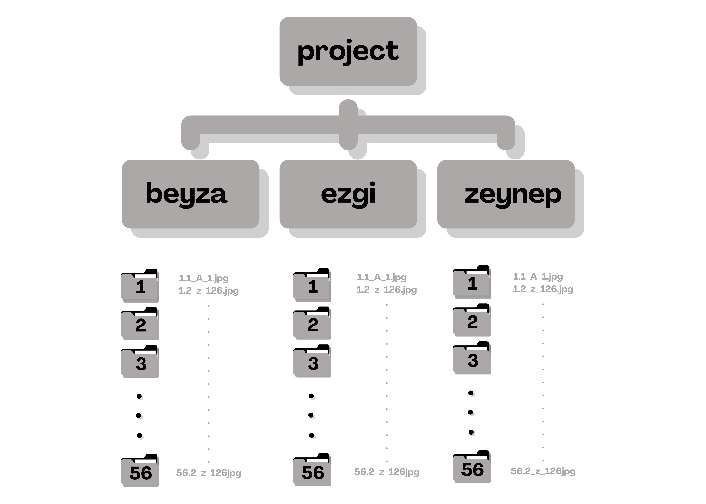

# Handwritten Letter and Person Recognition Project

## Overview

The project designed to not only recognize letters in the Turkish alphabet but also to uniquely identify individuals based on their distinct handwritten letters. Our primary goal is to develop a robust system capable of recognizing letters of the Turkish alphabet and identifying individuals based on their handwritten letters. 

## Dependencies

- Python 3.10.1
- TensorFlow
- Keras
- NumPy
- Matplotlib

## Dataset
We collected a dataset by asking individuals to write both uppercase and lowercase letters of the Turkish alphabet. Participants provided their written letters along with signatures to grant permission for data usage in order to follow KVKK rules. The dataset includes images of handwritten letters.
### Data Collection Process
Letter Writing: Participants were requested to write letters of the Turkish alphabet on paper.

Permission Signatures: Participants provided their signatures as a form of consent for using their data in our project.

Image Acquisition: We captured images of the handwritten letters and signatures using 3 cameras.

### Dataset Organization

The dataset is organized into the following structure:




In this structure, each individual's folder (beyza, ezgi, zeynep) contains subfolders numbered from 1 to 56. Within these subfolders, you'll find the images of 126 handwritten letters from each respective person. This reflects the fact that there are images from 56 people taken with 3 phones of beyza, ezgi, and zeynep.

## Usage
1. Download the Dataset:
   
3. Clone the repository:
   ```bash
   git clone https://github.com/beyzanurkeskin/YZV303E_TermProject_BEEB.git
   ```
4. Install dependencies:
   pip install -r requirements.txt
   
5. Run Jupyter Notebooks:
  * For a deeper analysis and exploration of the Handwritten Letter Recognition model, delve into the Jupyter notebooks located in the notebooks/ directory.
  * You can execute individual cells, allowing you to thoroughly analyze the handwritten letter recognition system. These notebooks provide an interactive environment for visualizing results, examining model architecture, and gaining valuable insights into the recognition process.

